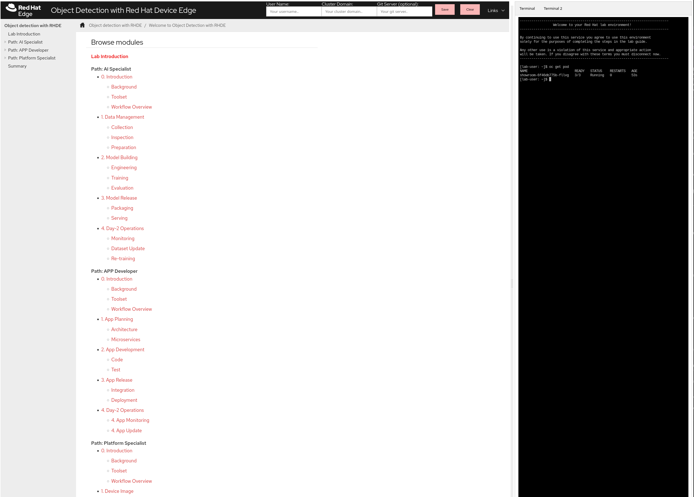

= Moving AI to the edge workshop

== Welcome to the Challenge

Congratulations! You are the newly appointed plant manager at ACME Co., a company specializing in plastic bottle manufacturing. However, your appointment comes at a turbulent time. In the past three months, the company has experienced three major accidents, resulting in serious injuries to machine operators. Two of these incidents occurred in the very plant you now oversee.

Your primary mission is clear: improve efficiency and reduce production costs while ensuring that such accidents never happen again. The key to achieving this lies in identifying and mitigating manufacturing hazards. This initiative is not just about compliance—it’s about creating a safer, more productive workplace.

=== Why Hazard Identification Matters
Identifying hazards in manufacturing is crucial for multiple reasons:

* Enhances Workplace Safety: Proactively identifying hazards enables preventive measures, reducing the likelihood of accidents or injuries.

* Cost Reduction: Preventing workplace incidents lowers medical expenses, compensation claims, and downtime, resulting in significant cost savings.

* Regulatory Compliance: Meeting OSHA (Occupational Safety and Health Administration) safety standards helps avoid penalties and legal issues.

* Boosts Productivity: A safer environment minimizes disruptions, improving employee morale and operational efficiency.

* Protects Long-term Health: Proper hazard identification reduces exposure to harmful substances and environments, safeguarding employees’ health.

* Strengthens Reputation: Demonstrating a commitment to safety enhances the company’s image, attracting top talent and fostering trust.

=== The Initiative: Leveraging Machine Learning for Accident Prevention
To address these challenges, you propose a forward-thinking initiative to reduce and prevent accidents using Machine Learning (ML). The goal is to develop and deploy an ML model capable of detecting PPE (Personal Protective Equipment) in real-time, issuing alerts when workers approach machinery without proper equipment.

Why ML? Machine Learning offers unparalleled capabilities in analyzing large volumes of data, detecting patterns, and generating real-time insights, making it ideal for enhancing workplace safety.

=== Available Resources
Fortunately, much of the hardware required to kickstart this project is already available on-site:

* Spare USB Cameras: Ready to capture and analyze video feeds of workers near machinery.

* Industrial PCs (IPCs) with NVIDIA GPUs: Ideal for image inference and processing, providing the computational power necessary for ML applications.

=== Building Your Team
To successfully implement this initiative, you need to assemble a cross-functional team. Collaboration across departments will be essential:

* Data Scientist / ML Engineer: Responsible for building and fine-tuning the ML model.

* IT/OT Platform Specialist: Assists in monitoring and automating the application. OT Specialist configure the Alarm Management System and ensures proper integration with existing plant operations.

=== The Path Forward
With the right team and tools in place, this initiative has the potential to transform workplace safety at ACME Co. Not only will it mitigate risks, but it will also position the company as a leader in innovative and responsible manufacturing practices.

Let’s get started and start building the future of safety!

== About the workshop

Now that you have the background, it's time to step into action. You will take on an active role within one of the team groups established to develop a working solution for this challenge. Think of this as a "choose your own adventure" experience, where you can adopt one of the following roles:

* AI Specialist / MLOps Engineer 

* Platform Specialist / Site Reliability Engineer (SRE)

Each role plays a critical part in delivering the overall solution. The AI Specialist crafts the intelligence behind the system, and the Platform Specialist guarantees the application runs efficiently in a production environment (the App Developer is also important and ensures smooth user interaction and integration but it won't be part of this workshop).

Start reviewing the xref:https://luisarizmendi.github.io/workshop-moving-ai-to-the-edge/modules/00-arch-intro.html[*Architecture*] and then choose your role... or try all of them if time allows!

Good luck on your mission to create a safer, smarter workplace!

== Using this repository

This repository contains the workshop guide, solutions and deployment scripts, you won't need to change anything on it since the Workshop guide will ask you to create your own empty repositories to complete the steps, but if you want to build your own workshop based on this one you will need to clone this repo (and probably it's a good idea to create a new branch for your workshop), and then perform the required changes in the Architecture page and the `antora.yml` file variables based on your setup. You will find more information about it in the xref:https://luisarizmendi.github.io/workshop-moving-ai-to-the-edge/modules/00-how_to_deploy_lab.html[Deployment Guide].

Bear also in mind that the https://docs.github.com/en/repositories/working-with-files/managing-large-files/about-large-files-on-github[large files support was enabled in this repository] (since we are pushing files with the AI models), so https://docs.github.com/en/repositories/working-with-files/managing-large-files/installing-git-large-file-storage[you will need to have Git LFS package install if you want to pull content to it].

== Accessing the workshop

==== GitHub Pages

You can take a view to the content preview (with no variables configured) by simply visiting GitHub Pages for this repo in `https://luisarizmendi.github.io/workshop-moving-ai-to-the-edge/modules/index.html`

==== Using Antora Viewer

You can access the content by using an antora-viewer container image:

. Clone the repo and `cd` into it
. When you make changes to the content, all you need is to kill the container and run it again.
+
[source,sh]
----
podman run --rm --name antora -v $PWD:/antora -p 8080:8080 -i -t ghcr.io/juliaaano/antora-viewer
----

For SELinux environments, `:z` may need to be appended to the volume mount:

----
podman run --rm --name antora -v $PWD:/antora:z -p 8080:8080 -i -t ghcr.io/juliaaano/antora-viewer
----

Live-reload is not supported.

==== Using local file scripts

You can also

. Clone the repo and `cd` into it
. Run ./utilities/lab-build
. Run ./utilities/lab-serve to publish the guide
. Open http://localhost:8080 in your browser

To rebuild your html, run `./utilites/lab-build`.

=== Showroom

This workshop can be embeded into [Showroom](https://github.com/luisarizmendi/showroom-deployer) to get the content along with Terminals with specific tooling/access (Katacoda style) if needed:

