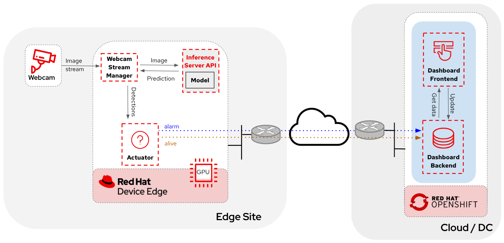

# Object detection with Webcam

This is an example use case of how you can use a webcam to detect objects at the edge, and how those detections can trigger messages/alarms that can be visualized in a dashboard on the Core Datacenter/Cloud.

## Application architecture




[Camera Stream Manager](object-detection-stream-manager/README.md)

[Inference server](object-detection-inference-server/README.md)

[Actuator service](object-detection-action/README.md)

[Dashboard backend](object-detection-dashboard/src/backend/README.md)

[Dashboard frontend](object-detection-dashboard/src/frontend/README.md)


## Application workflow

1. The Camera Stream Manager sends images to the Inference API
2. The Inference Server, that contains the AI model detecting objects, returns the predictions
3. The "action" service calls the inference endpoint and if detects certain objects it will trigger an alarm, that is sent to the database hosted in a remote site.
4. The information of the database is shown in the database


## Example screenshots

Live video stream detection from the inference server:


Main Dashboard screen:


Device details screen on the Dashboard:


## Quick local setup

If you want to run a quick test you could run all components locally. First start the inference server:

```bash
podman run -d -p 8080:8080 quay.io/luisarizmendi/object-detection-inference-server:prod
```

> NOTE
>
> If you have an NVIDA GPU you might want to use it by adding `--device nvidia.com/gpu=all --security-opt=label=disable`


Then the APP that manages the stream from your camera (as root):

```bash
sudo podman run -d -p 5000:5000 --privileged --network=host quay.io/luisarizmendi/object-detection-stream-manager:prod
```

After that, start the rest of the services:


```bash
podman run -d --network=host quay.io/luisarizmendi/object-detection-action:prod

podman run -d -p 5005:5005 quay.io/luisarizmendi/object-detection-dashboard-backend:prod

podman run -d -p 3000:3000 quay.io/luisarizmendi/object-detection-dashboard-frontend:prod
```


Then you can see the video stream in `http://localhost:5000/video_stream` and the dashboard in `http://localhost:3000`


## Multi-arch Container Images

You can create a container image compatible with both x86 and ARM systems, and push it to a Container Image Registry that supports multi-architecture images.

To achieve this, you need to build the image for both architectures, which may require two separate Containerfiles with different base images. 

However, it's possible to create both images on the same system. For example, if you're running on an x86 machine with Podman, you can use `qemu-user-static` to build the ARM image as well:

### Creating ARM Container Images in x86 System (example)


1. Install `qemu-user-static`

```bash
sudo dnf install podman qemu-user-static
```

2. Run the `qemu-user-static` container

```bash
sudo podman run --rm --privileged multiarch/qemu-user-static --reset -p yes
```

3. Now you could create an ARM image in your x86 system with this command.

```bash
podman build --platform linux/arm64  -t <arm image> .
```


### Creating the Multi-arch Container Image


1. Build the images for both x86 and ARM64

```bash
# Build for x86 (amd64)
podman build --platform linux/amd64 -t <image>:x86 .

# Build for arm64
podman build --platform linux/arm64 -t <image>:arm .
```


2. Create the manifest list. After building both images, create a manifest list to combine them (e.g., with tag `prod`). This list will point to both the x86 and arm64 images:

```bash
podman manifest create <image>:prod
podman manifest add <image>:prod <image>:x86
podman manifest add <image>:prod <image>:arm
```


3. Finally publish the manifest

```bash
podman manifest push <image>:prod
```

> NOTE
> 
> It is `podman manifest push` not just `podman push`


